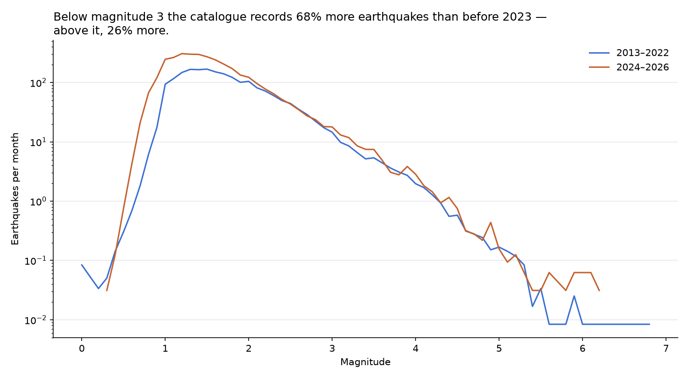
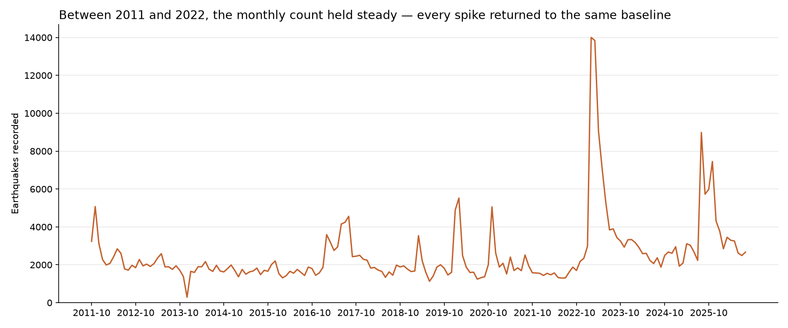

# Are earthquakes becoming more frequent?

*Fifteen years of AFAD's earthquake catalogue (2011–2026), cleaned and tested.*

I live in Istanbul, where a large earthquake is expected, and the news
regularly says that earthquakes are on the rise. In January 2021 TRT Haber
reported that 2020 saw 33,824 earthquakes, a 44% increase on the year before.
The arithmetic was right, but most of that jump came from two large
earthquakes and their aftershocks: Sivrice (Elazığ, M6.8) in January and
Seferihisar (İzmir, M6.6) in October.

This project asks the same question with the full catalogue, and tries to
separate what changed in the ground from what changed in the way it is
measured.

**Short version: the catalogue records far more earthquakes than it used to,
but a rising count of records is not evidence that earthquakes are
increasing.**

## What I found



- **Below magnitude 3, the monthly count rose 68%** from 2013–2022 to
  2024–2026. Aftershocks cannot explain this: they come in every size, so they
  would have raised the count above magnitude 3 by a similar amount. The rise
  comes from small earthquakes entering the catalogue — events that were
  happening before but were not being recorded.
- **Above magnitude 3, the count rose 26%, and all of it comes from a single
  sequence:** Sındırgı (Balıkesir), M6.1, 10 August 2025. Without 2025, the
  later period averages 70 events a month, against 73 before.
- **So the records are increasing. Whether earthquakes are increasing cannot be
  answered from these totals** — that would need a catalogue whose detection
  and magnitude scales stayed the same over time. In the one band where the
  catalogue is comparable, above magnitude 3, there is no evidence of an
  increase.

## Why the raw count misleads



Two different things push the count up, and neither is a trend:

- **Sequences.** One large earthquake produces thousands of records in the
  months that follow. Every spike above is a sequence, and between 2011 and
  2022 each one returned to the same baseline.
- **Detection.** After 2023 the baseline itself sits higher. Almost all of the
  extra records are below magnitude 3.

## Data quality

Cleaning keeps all 481,591 records. Problems are flagged, not deleted, and
every decision is documented in [`02_clean.ipynb`](notebooks/02_clean.ipynb).
Two findings shaped the analysis:

- **Magnitude scales changed.** The share of records measured on the duration
  scale (Md) fell from 33% to 1% between 2011 and 2013
  ([chart](docs/magnitude_scale_transition.png)). Scales are not
  interchangeable: local magnitude (ML) tops out around 6.7 in this catalogue,
  which is why the 2011 Van earthquake appears as ML 6.7 although it is known
  as Mw 7.1–7.2. Comparisons that depend on magnitude therefore start in 2013.
- **A gap in the source.** December 2013 holds about a sixth of the records of
  the months around it, and 31 December 2013 has none. AFAD's own interface
  returns the same count, so the gap is in the catalogue, not in my download.
  Details in [`data_quality_notes.md`](docs/data_quality_notes.md).

## Limitations

- The later period is only 32 months long and follows the largest earthquake
  in the catalogue. Above magnitude 3 the rate is driven by individual
  sequences, so a window this short can move a long way on a single event.
- The detection explanation is inferred from the magnitude distribution. I did
  not have station-level data showing when and where the network was expanded.
- AFAD monitors a wider region than Turkey. The analysis uses a
  latitude/longitude box (36–42°N, 26–45°E), which is a rectangle, not the
  border, so results describe records in the AFAD catalogue inside that box.

## Reproduce

Tested with Python 3.14.

```
python -m venv .venv
.venv\Scripts\activate          # Windows
source .venv/bin/activate       # macOS / Linux
pip install -r requirements.txt
```

1. Download the catalogue as described in [`data/raw/README.md`](data/raw/README.md).
2. Run `notebooks/02_clean.ipynb`. It writes `data/processed/afad_clean.csv`
   and checks the result with `validate()`.
3. Run `notebooks/03_analysis.ipynb`. It reproduces every number and chart
   above.

`01_explore.ipynb` is the first pass through the raw data, where the issues
were found.

## Structure

```
data/
  raw/            AFAD export (not committed) + download instructions
  processed/      output of 02_clean (not committed)
docs/             charts, data quality notes, sources
notebooks/
  01_explore.ipynb
  02_clean.ipynb
  03_analysis.ipynb
requirements.txt
```

Sources for the news reports and images used here are listed in
[`docs/sources.md`](docs/sources.md).
